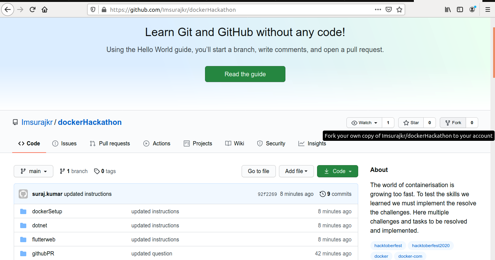
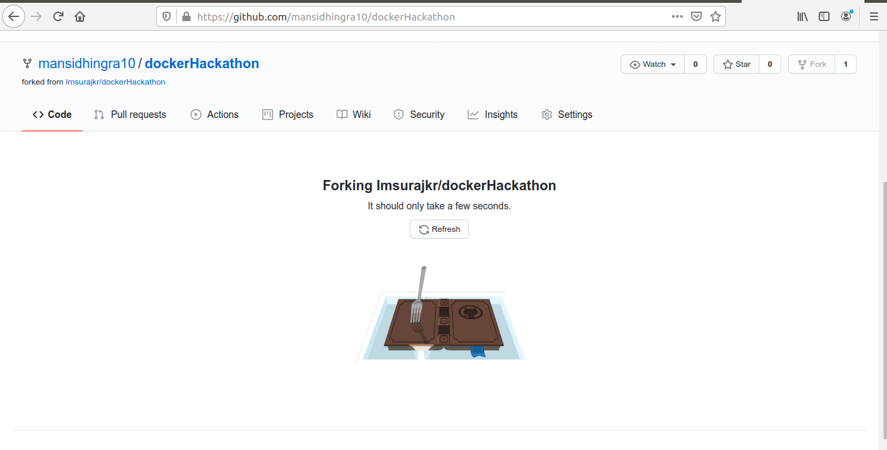
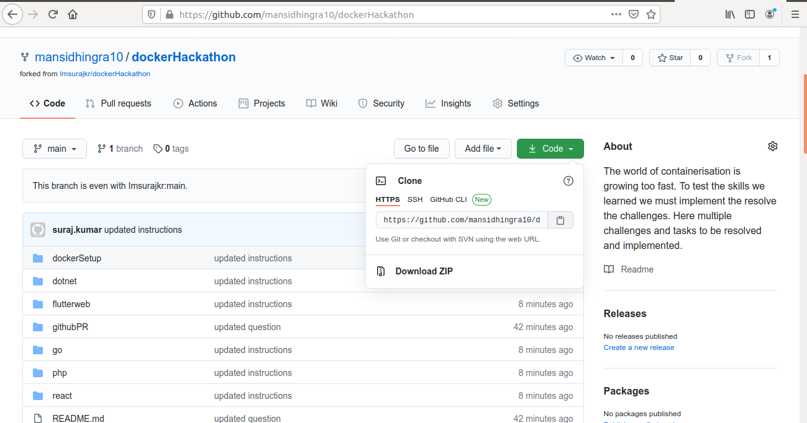
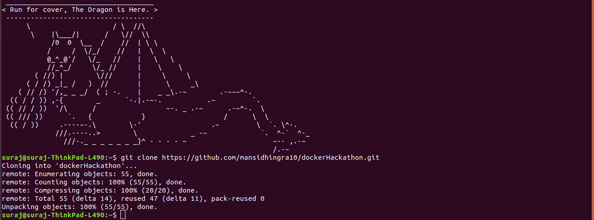
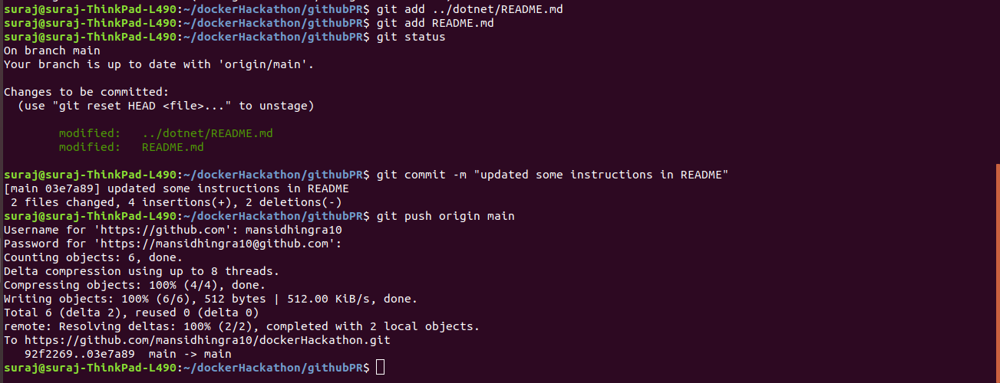
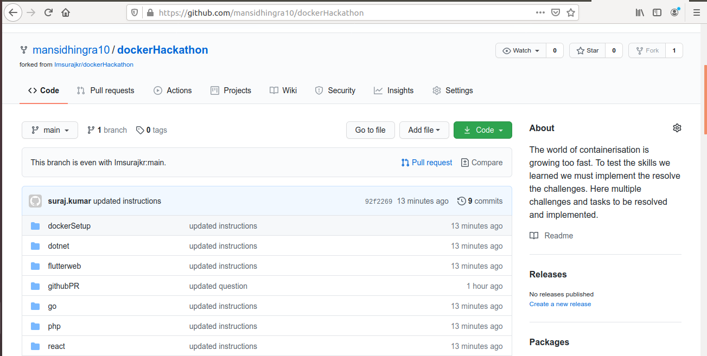
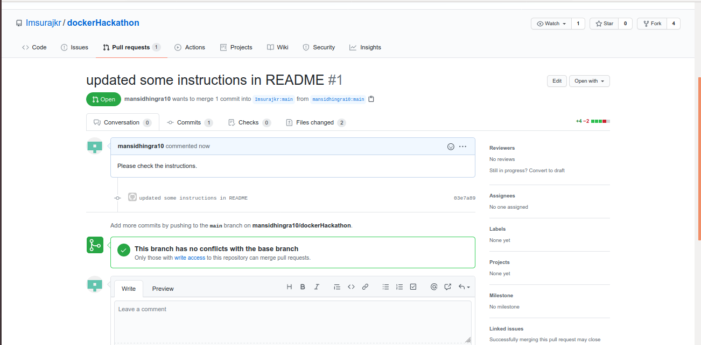

# Let's begin the journey.

## Register on hacktober fest [here](https://hacktoberfest.digitalocean.com/)
Step 1: Click on **start hacking**. 
Step 2: **Sign in with Github** . 
Step 3: Select **participant** . 

## Instructions to complete the task and commit 

### Step 1: Login to [github.com](https://github.com).
### Step 2: Click on Fork repo.
 
 
### Step 3: Clone the repository. 
 
 
### Step 4: Add commit and push your changes.

### Step 5: Create pull request.

### Step 6: Resolve confilicts & Discuss on your changes.
  